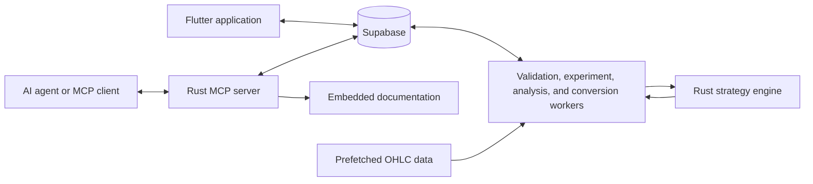

# Alphchemy

Alphchemy is a full-stack platform for designing, optimizing, backtesting, and analyzing algorithmic trading strategies. Experiments are written in a compact source format, evaluated with cross-validated backtests, and stored for comparison and further analysis.

The platform can be used through a Flutter application or through an authenticated [Model Context Protocol (MCP)](https://modelcontextprotocol.io/) server. The MCP interface gives AI agents the same experiment, analysis, documentation, and conversion workflows available in the application.

> Alphchemy is research and experimentation software. Backtest results do not guarantee future performance.

## What Alphchemy Does

- Defines strategies with technical features and either boolean logic or decision networks
- Searches for improved networks with a configurable genetic algorithm optimizer
- Evaluates candidates across training, validation, and test windows
- Tracks experiments, fold-level metrics, and generated strategies in Supabase
- Compares completed experiments through notebooks and a query language
- Converts selected strategy folds to PineScript
- Exposes authenticated MCP tools for AI-assisted experimentation

## Experiment Workflow

1. Write an experiment source describing the date range, features, network, actions, optimizer, and backtest settings.
2. Validate the source before submitting work to the experiment queue.
3. Load prefetched OHLC data for the requested symbol and period.
4. Compute features and divide the data into cross-validation folds.
5. Optimize candidate networks on each training window.
6. Select the candidate with the best validation score.
7. Evaluate the selected candidate on its training, validation, and test windows.
8. Explore the stored results in the application, through notebooks, or with an MCP client.

A minimal experiment can rely on parser defaults for everything except its date range and features:

```text
start_timestamp: 2024-01-01
end_timestamp: 2024-07-01
strategy:
  feats:
    rsi_14:
      feature: rsi
    ema_20:
      feature: normalized_ema
      window: 20
```

The built-in documentation contains the complete source format, available features, network behavior, optimizer settings, result fields, and query syntax.

## Architecture



Supabase is the shared coordination layer. The Flutter application reads and writes application state directly, while Rust workers poll for queued validation, experiment, notebook, and conversion jobs. The experiment worker delegates strategy evaluation to the engine and writes the results back to Supabase. The MCP server authenticates each request and exposes the same workflows as tools for AI clients.

## Tech Stack

- **Rust:** experiment engine, parser, workers, query processing, documentation server, and MCP server
- **Flutter and Dart:** web and desktop user interface using BLoC state management
- **Supabase:** authentication, Postgres persistence, row-level access, and job coordination
- **Axum and RMCP:** HTTP documentation and streamable HTTP MCP services
- **PineScript:** generated output for selected optimized strategies

## Repository Guide

| Path | Responsibility |
| --- | --- |
| `alphchemy_app/` | Flutter application for authentication, experiment editing, results, notebooks, documentation, and settings |
| `crates/alphchemy_engine/` | Features, networks, actions, genetic optimization, cross-validation, and backtesting |
| `crates/alphchemy_parse/` | Experiment source parser and asynchronous validation worker |
| `crates/alphchemy_experiments/` | Experiment worker and local OHLC data loading |
| `crates/alphchemy_analysis/` | Experiment queries, result formatting, notebooks, and shared tool operations |
| `crates/alphchemy_convert/` | Strategy conversion and PineScript generation |
| `crates/alphchemy_docs/` | Embedded reference documentation and HTTP documentation service |
| `crates/alphchemy_mcp/` | Authenticated MCP server exposing documentation and platform operations |
| `data/` | Market-data fetcher and generated OHLC JSON files |

## Local Development

### Prerequisites

- A current Rust toolchain with Cargo
- Flutter with Dart `3.11` or later
- A configured Supabase project
- `uv` for the optional market-data fetcher
- A CoinAPI key if new OHLC data needs to be downloaded

The repository does not currently include Supabase migrations or automated infrastructure provisioning. A development instance must already contain the expected `experiments`, `notebooks`, `validation_jobs`, `convert_jobs`, `api_keys`, and `benchmarks` tables with the required policies.

### Backend Configuration

Create `.env` in the repository root:

```dotenv
SUPABASE_URL=https://your-project.supabase.co
SUPABASE_KEY=your-backend-key
COINAPI_KEY=your-coinapi-key
```

`COINAPI_KEY` is only required when fetching market data. Both `.env` and generated data files are ignored by Git.

### Flutter Configuration

Create `alphchemy_app/lib/env.dart`:

```dart
const supabaseUrl = "https://your-project.supabase.co";
const supabaseKey = "your-publishable-key";
const docsServerUrl = "http://localhost:5050";
```

This file is ignored by Git and should not contain a Supabase service-role key.

### Market Data

Experiment execution reads prefetched hourly OHLC files from `data/`. To populate the supported symbols with CoinAPI data:

```bash
uv run --with requests data/fetch_data.py
```

The fetcher downloads up to six years of data for its configured symbols and consumes CoinAPI credits. Generated JSON files remain local.

### Run the Rust Services

From the repository root:

```bash
./run_alphchemy.sh
```

The launcher builds and runs the validation, experiment, analysis, conversion, documentation, and MCP processes. It also stops all child processes when the launcher exits.

- Documentation service: `http://localhost:5050`
- MCP service: `http://localhost:8000/mcp/<api-key>`

### Run the Application

In a second terminal:

```bash
cd alphchemy_app
flutter pub get
flutter run
```

After signing in, the settings page displays the user's MCP API key and setup commands for supported clients.

For example:

```bash
codex mcp add alphchemy --url http://localhost:8000/mcp/<api-key>
claude mcp add --transport http alphchemy http://localhost:8000/mcp/<api-key>
```

## Tests

Run the Rust workspace tests from the workspace root:

```bash
cd crates
cargo test --workspace
```

Run the Flutter tests separately:

```bash
cd alphchemy_app
flutter test
```

The test suites cover strategy behavior, indicators, networks, backtesting, optimization, parsing, query processing, Supabase-facing tools, documentation routing, MCP authentication, and application state.

## Current Status

Alphchemy is under active development. Its core experiment, analysis, application, documentation, and MCP workflows are implemented, but local setup currently assumes an existing Supabase deployment and locally prefetched market data.
